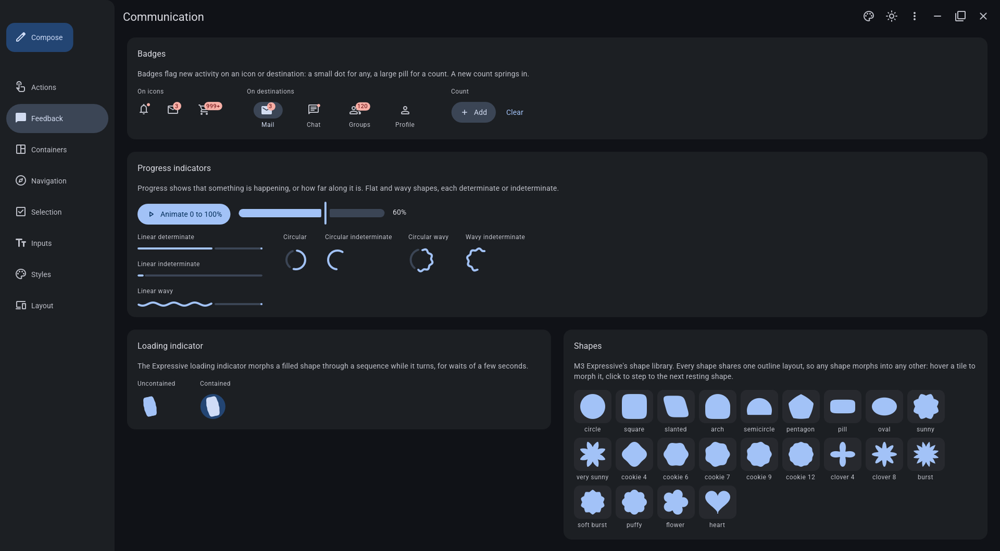
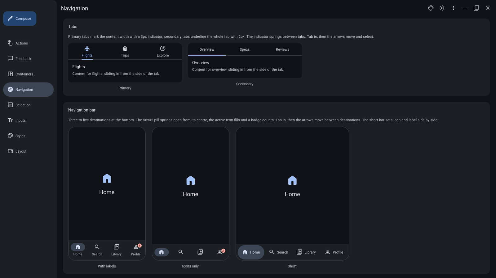

# mantle-material





A Material 3 (Material You, including M3 Expressive) component library for the
[Mantle](https://github.com/anasgets111/mantle) shell engine, with a demo app that shows every
component.

- 50+ components across M3's categories: actions (buttons, FABs, button groups, split and
  segmented buttons), communication (badges, progress, loading indicator, tooltips), containment
  (cards, carousel, lists, sheets), navigation (tabs, bar, drawer, rail, app bars, toolbars),
  selection (checkbox, radio, switch, chips, slider, menus, date and time pickers) and text inputs.
- Dynamic colour: all 49 colour roles derive live from one seed, in light or dark and any scheme
  variant.
- The Expressive motion springs, the type scale with its emphasized styles, shapes and elevation.
- Adaptive layout: window size classes, navigation that becomes a bar, rail or drawer by width, and
  list-detail panes.

## Use it

Copy or symlink `m3/` into your Mantle config directory, then:

```lua
fonts { "Roboto", "Noto Sans" } -- Roboto is M3's typeface (`ttf-roboto`); icons use Material Symbols Rounded
local m3 = require("m3")
m3.theme.seed:set("#6750A4") -- optional

return {
    m3.app_window {
        id = "app",
        title = "My app",
        child = m3.button("save", { label = "Save", on_click = function() m3.overlay.notify("Saved") end }),
    },
}
```

Requirements, conventions and the API are in [`m3/README.md`](m3/README.md), with one doc per
category in `m3/docs/`.

## Run the demo

```sh
mantle -c .
```

The demo's wallpapers are in `demo/wallpapers/`, from the Mantle repo's own demo; the Styles page
seeds the scheme from whichever you pick.

## Layout

| Path | Holds |
| :--- | :--- |
| `m3/` | The library, one file per component family, `internal/` helpers and `docs/` |
| `demo/`, `shell.lua` | The demo app, one page per M3 category |
| `justfile` | `just`: syntax, LuaLS types and `mantle check` |

## Editor setup

`.luarc.json` gives lua-language-server the engine's API stubs, so the editor completes and
type-checks Mantle and the library. Its `workspace.library` points at a Mantle checkout's
`lua-meta/`; change it to wherever your stubs are:

| Mantle from | Stubs |
| :--- | :--- |
| A package | `$PREFIX/share/mantle/lua-meta` (usually `/usr/share/mantle/lua-meta`) |
| A plain binary | `$XDG_DATA_HOME/mantle/lua-meta` (usually `~/.local/share/mantle/lua-meta`), written by `mantle init` |
| A source checkout | `<checkout>/lua-meta` |

`just types` runs the same check from the command line.

## Notes

Not affiliated with or endorsed by Google. Material Design and Material You are trademarks of Google
LLC. Icons use the Material Symbols font, which you install separately.

## License

[MIT](LICENSE).
